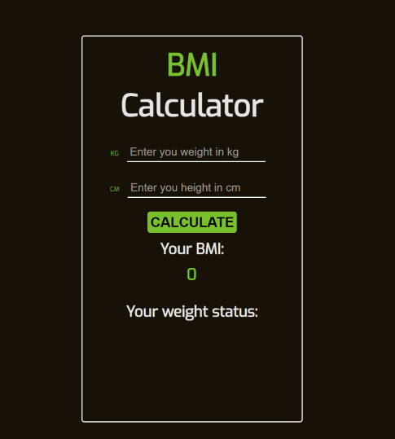

# BMI calculator

## About

BMI (Body Mass Index) is a value derived from the weight and the height. It gives back your weight status (underweight, normal weight, overweight or obesity) which based on the calculated BMI points.

You have to give your weight in kilograms and your height in centimetres. After that click on the *calculate* button, and the app shows your BMI point and weight status.

## Credits

  - [React](https://reactjs.org/)
  - [TypeScript](https://www.typescriptlang.org/)
  - [Styled Components](https://styled-components.com/)